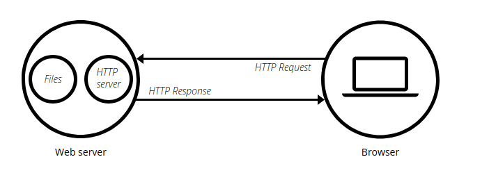

# NODEJS WEB SERVER USING EXPRESS

# Bài 1: Giới thiệu

## Web Server

- Web Server có thể phần cứng hoặc phần mềm, hoặc cả hai.
  - Về mặt phần cứng: một web server là một máy tính lưu trữ các file thành phần của một website (html, images, css, js,...) và có thể chuyển chúng tới thiết bị của người dùng cuối (end-user). Nó kết nối tới mạng Internet và có thể truy cập thông qua một tên miền.
  - Về mặt phần mềm: một web server bao gồm một số phần để điều khiển cách người dùng truy cập tới các file được lưu trữ trên một HTTP server (máy chủ HTTP). Một HTTP server là một phần mềm hiểu được các URL (các địa chỉ web) và HTTP (các giao thức mà trình duyệt sử dụng để xem các trang web).
- Khi trình duyệt cần một file được lưu trữ trên một web server, trình duyệt request file đó thông qua HTTP. Khi một request tới đúng web server (phần cứng) thì HTTP server (phần mềm) sẽ gửi tài liệu được yêu cầu trờ lại thông qua HTTP.

- Để tạo một website, ta cần một static hoặc một dynamic web server

## Static vs Dynamic Web Server

- Một Static web server (hoặc stack) bao gồm một máy tính (hardware) với một HTTP server (software). Ta gọi nó là static vì server (máy chủ) gửi các file nó lưu trữ "nguyên vẹn" tới trình duyệt của người resquest.
- Một dynamic web server bao gồm một static web server và các phần mềm mở rộng, phổ biến nhất là một application server (máy chủ ứng dụng) và một database. Ta gọi nó là dynamic bởi vì application server cập nhật các file được lưu trữ trước khi gửi chúng tới trình duyệt thông qua HTTP server.
  - Ví dụ: Để tạo ra các trang web mà ta sử dụng trong trình duyệt, application server có thể điền một HTML template với nội dung lấy từ database. Các site như MDN, Wiki có rất rất nhiều trang web nhưng chúng không phải tài liệu HTML thực sự mà chỉ là vài template HTML với một database khổng lồ. Điều này làm cho nó dễ dàng và nhanh hơn để maintain và gửi nội dung trang web.

## Learn more

Để lấy một trang web, trình duyệt sẽ gửi một request tới web server, nó sẽ tìm kiếm file được yêu cầu đã lưu trên ổ đĩa của nó. Khi tìm thấy file, server đọc nó, xử lý nếu cần và gửi nó tới trình duyệt.

### Lưu trữ các file (Hosting file)

- Trước hết, web server phải lưu trữ các file của website: các file HTML, images, file CSS, file JS, fonts, videos,...
- Ta có thể lưu trữ các file đó trên máy tính của mình, tuy nhiên khi lưu trữ trên một máy chủ riêng biệt có lợi hơn rất nhiều:
  - Luôn sẵn sàng sử dụng.
  - Luôn có kết nối mạng internet
  - Có một địa chỉ ip cố định
  - Được maintain bởi nhà cung cấp.

### Giao tiếp thông qua HTTP

- Một web server sẽ hỗ trợ HTTP (giao thức truyền phát siêu văn bản HyperText Transfer Protocol).

- Giao thức là tập hợp các quy tắc để kết nối giữa hai máy tính. HTTP là một giao thức textual, stateless.
  - Textual: Tất cả các lệnh là văn bản thuần túy, con người có thể đọc được
  - Stateless: Cả server và client không nhớ kết nối trước đó. Ví dụ: nếu chỉ có HTTP, một server không thể nhớ mật khẩu bạn đã nhập hoặc bước nào bạn đã làm trong một giao dịch. Bạn cần một application server để làm nhiệm vụ này.

## NodeJS

- Node.js là một nền tảng phát triển mã nguồn mở để thực thi mã nguồn Javascript ở phía server.
- Node.js có thể chạy trên nhiều hệ điều hành khác nhau.
- Nodejs cung cấp các thư viện phong phú ở dạng javascipt Module giúp cho việc lập trình dễ dàng, thuận thiện hơn.
- Sử dụng nodejs có thể tạo ra được các ứng dụng có tốc độ xử lý nhanh, realtime.
- Nodejs áp dụng cho các sản phẩm có lượng truy cập lớn, cần mở rộng nhanh, cần đổi mới công nghệ hoặc tạo ra những dự án Startup nhanh nhất có thể.
- Những chương trình nên viết bằng Node.js:
  - Websocket Server: các máy chủ web socket như online chat, game server...
  - Fast File Upload Client: các chương trình upload file tốc độ cao.
  - Add server: các máy chủ quảng cáo.
  - Cloud services: các dịch vụ đám mây.
  - RESTufl API: Các dich vụ ứng dụng à được sử dụng cho các ứng dụng khác thông qua API.
  - Các ứng dụng yêu cầu về tốc độ thời gian thực.
- Những sai lầm về Node.js:
  - Node.js là một **nền tảng (platform)** mà không phải **Framework hay ngôn ngữ lập trình**.
  - Node.js **không hỗ trợ đa luồng**, nó là một máy chủ **đơn luồng**.

## ExpressJS

- ExpressJS là một Framework nhỏ, nhưng lại linh hoạt được xây dựng trên nền tảng của NodeJS. Nó cung cấp các tính năng mạnh mẽ để phát triển web hoặc mobile.

